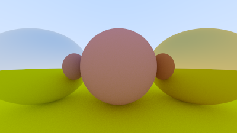
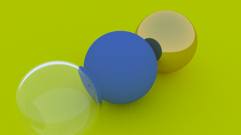

# rusty-raytracer

A raytracer slapped together in one weekend based on [_Ray Tracing in One Weekend_](https://raytracing.github.io/books/RayTracingInOneWeekend.html) by Peter Shirley. 

Translated from C++ into Rust by me.

Since [my old ray tracer](https://github.com/tdude92/raytracer) was pretty awful, I thought it'd be a fun exercise to translate _Ray Tracing in One Weekend_ into Rust.

## Raytraced Images

